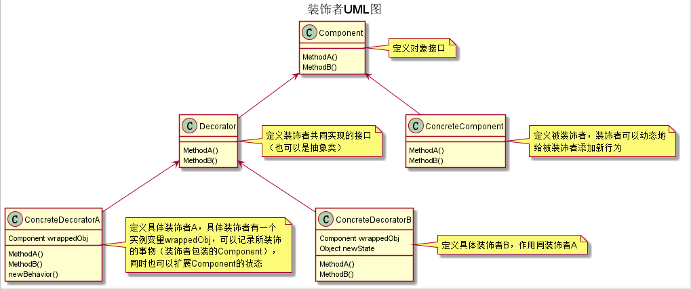

## 装饰者模式(增强自己的能力)
### 来看一段以继承为例子的卖蛋糕的例子
- 首先我们创建一个抽象的蛋糕类
  ``` java
  public abstract class ACake {
      public abstract String getDesription (); // 描述
      public abstract int cost ();            // 价格
  }
  ```
- 实现一个蛋糕类
  ``` java
  public class Cake extends ACake {
      @Override
      public String getDesription () {
          return "一个蛋糕";
      }

      @Override
      public int cost () {
          return 10;
      }
  }
  ```
- 现在想要在蛋糕上放一块苹果
  ```java
  public class AppleCake extends Cake {
      @Override
      public String getDesription () {
          return super.getDesription() + ", 一块苹果";
      }

      @Override
      public int cost () {
          return super.cost() + 10;
      }
  }
  ```
- 然后想要放一块橙子
  ``` java
  public class OrangeCake extends Cake {
      @Override
      public String getDesription () {
          return super.getDesription() + ", 一块橙子";
      }

      @Override
      public int cost () {
          return super.cost() + 5;
      }
  }
  ```
### 分析
```
由以上的代码可见, 如果要在蛋糕上放两块苹果一块橙子, 或者放两块苹果两块橙子则需要再创建类, 从而实现
该功能, 那么如果样式更多, 则类会越来越多, 这就是通过继承来实现的坏处, 接下来将引入装饰者模式, 装饰
者模式可以在不改变原来的类即蛋糕类, 苹果蛋糕类的情况下对该对象进行装饰。在看下面的代码之前, 我们先
说一下装饰者模式可以使用的情况, 一个类被final修饰了, 无法继承, 或者通过继承不利于扩展的情况(如上)
```

### 先来看一个从博客上拷贝下来的UML图



### 看完这个图后对装饰者的大概模型应该是懂了, 接下来我们实现一个装饰者先

- 抽象蛋糕类
  ```java
  public abstract class ACake {
      public abstract String getDescription ();
      public abstract int cost ();
  }
  ```
- 实体蛋糕类
  ```java
  public class Cake extends ACake {
      @Override
      public String getDescription () {
          return "一个蛋糕";
      }

      @Override
      public int cost () {
          return 10;
      }
  }
  ```
- 装饰者抽象类(继承于Cake抽象类)
  ```java
  public abstract class CakeDecorator extends ACake {
      // 这里可以添加一些额外的功能, 比如一个doSomething抽象方法
      // 从而让子类可以实现该方法, 从而使得子类功能增加
  }
  ```
- 具体的装饰者类苹果蛋糕类
  ```java
  public class AppleCakeDecorator extends CakeDecorator {
    private ACake cake;

    public AppleCakeDecorator (ACake cake) {
      this.cake = cake;
    }

    @Override
    public String getDescription () {
      return cake.getDescription() + ", 一个苹果";
    }

    @Override
    public int cost () {
      return cake.cost() + 3;
    }
  }
  ```
### 分析
```
这里肯定有人会有疑问了, 你这个装饰者继承于ACake是啥意思? 你这个实现的装饰者苹果蛋糕类为啥要将Acake
参数传进去呢? 接下来我们先看一个测试的例子=,=
```
- 测试类
  ```java
  public static void main (String[] args) {
    // 一块蛋糕
    ACake cake = new Cake();
    System.out.println( cake.getDescription() );

    // 蛋糕内放一块苹果
    AppleCakeDecorator decorator = new AppleCakeDecorator( cake );
    System.out.println( decorator.getDescription() );

    // 蛋糕内再放一块苹果
    decorator = new AppleCakeDecorator( decorator );
    System.out.println( decorator.getDescription() );

    // 蛋糕内继续放一块苹果
    decorator = new AppleCakeDecorator( decorator );
    System.out.println( decorator.getDescription() );
  }
  ```
- 输出结果
  ```
  一个蛋糕
  一个蛋糕, 一块苹果
  一个蛋糕, 一块苹果, 一块苹果
  一个蛋糕, 一块苹果, 一块苹果, 一块苹果
  ```

### 问题一: 装饰者为什么继承于ACake
```
因为这样能够类型匹配, 即使不继承于也没关系, 但是如果继承了的话, 那么Cake所在的参数就可以被装饰者来
替换, 从而可以更加的灵活
```
### 问题二: 实现的装饰者苹果蛋糕类为啥要将Acake参数传进去呢
```
根据我们的测试类可以看到, 我们通过将ACake类型的对象作为参数传进去, 从而可以在AppleCakeDecorator
类中对其进行装饰, 并且能够装饰多次,我们可以看到, 我们的decorator后来又被多次作为参数传进了
AppleCakeDecorator类中, 从而进行了多次装饰, 并且呢, 这也是AppleCakeDecorator继承于ACake的好处
```     
 
### java的IO流
  ```java
  ObjectInputStream objectInputStream = 
        new ObjectInputStream( new FileInputStream( new File("xx") ) );

  我们可以看到, File类被FileInputStream装饰成一个文件输入流, 为了反序列化, 又
  将文件输入流进行一下装饰从而装饰成了对象输入流      
  ```

### 总结一下
```
定义: 在不改变原有对象的基础之上, 将功能附加到对象上
      提供了比集成更有弹性的替代方案(扩展原有对象功能)
适用场景: 扩展一个类的功能或给一个类添加附加职责,  动态的给一个对象添加功能, 这些功能可以在动态的
         撤销, 即我们的测试类中cake被装饰者装饰成decorator苹果蛋糕类, 然后decorator又可以动态的
         继续被装饰

优点: 继承的有力补充, 比继承灵活, 不改变原有对象的情况下给一个对象扩展功能          
      通过使用不同装饰类以及这些装饰类的排列组合, 可以实现不同效果
      符合开闭原则
缺点:
    会出现更多的代码, 更多的类, 增加程序复杂性
    动态装饰时, 多层装饰时会更加复杂
```