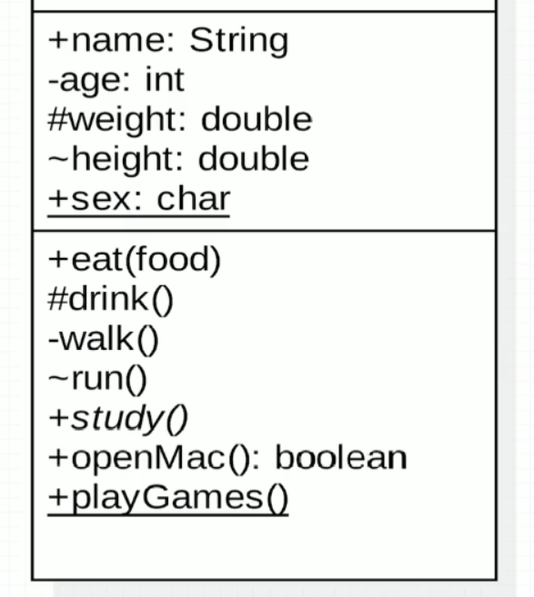
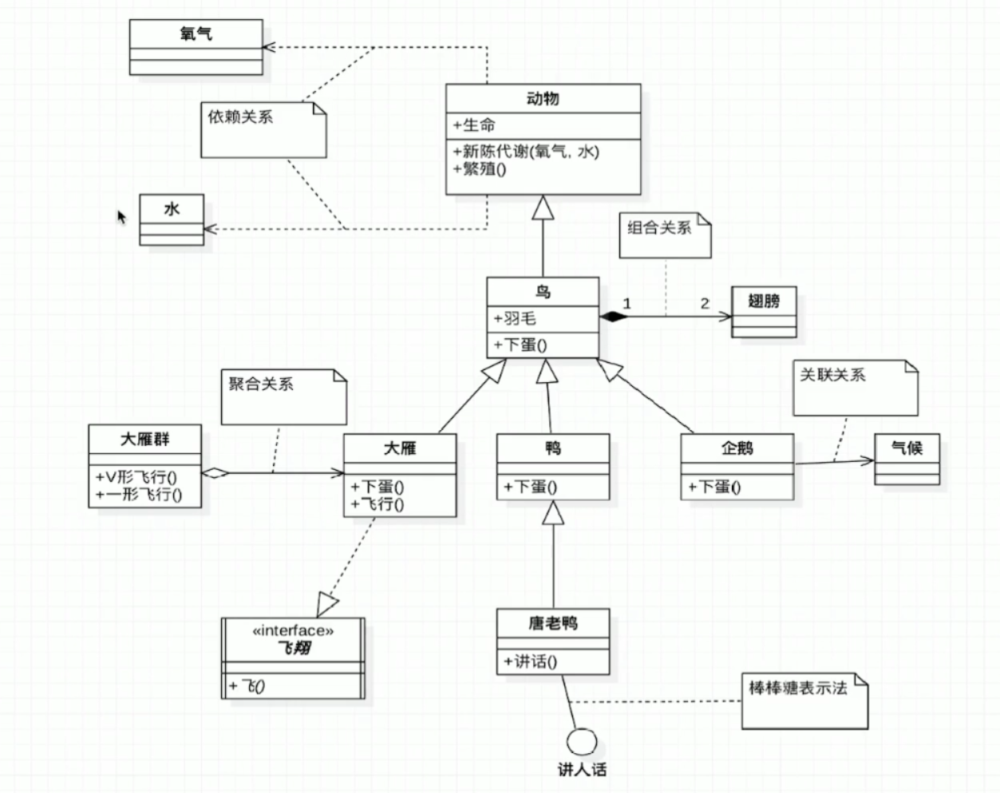

## 类图: 用于描述一个类
    ```
    +表示public
    -表示private
    #表示protected
    ~表示默认的default
    方法或者属性下面有一条横线则表示static
    抽象方法或抽象类的名称需要用斜体表示
    方法的返回值或者属性的类型写在冒号的后面
    ```
    

## 类之间的关系表示
    ```
    依赖关系: 由虚线和箭头表示, 如A依赖于B, C, 可以是A的方法参数是B和C
    关联关系: 由实线和箭头表示, 例如企鹅和气候是关联关系, 气候作为企鹅的属性
    
    继承或者实现: 空心三角箭头 
        实线-继承: is a关系
        虚线-实现: 实现一个接口需要重写抽象方法, 可以认为虚线很空, 需要用内容来填充(也可以用棒棒糖表示法)
    
    聚合关系: 空心菱形, 整体和局部的关系, has a关系, 如大雁群和大雁, 整体和局部的关系, 大家聚在一起叫聚合 
    组合关系: 实心菱形, 例如鸟和翅膀是组合关系, 鸟的一部分需要是翅膀, 所以叫组合
    
    常见数字表达及含义:
        0..1: 0或1个实例
        0..*: 0或多个实例
        1..1: 1个实例
        1   : 只能有1个实例
        1..*: 至少有1个实例
    ```

 


