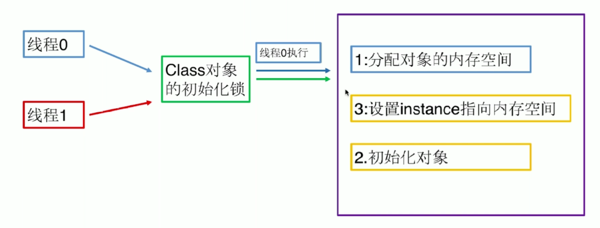

## 懒汉式单例模式

### 先来看一段单线程下的懒汉式单例模式代码
  ```
  public class LazySingleton {
    private LazySingleton () {}
    private static LazySingleton lazySingleton = null;

    public static LazySingleton getInstance () {
      if ( lazySingleton == null ) {
        lazySingleton = new LazySingleton();
      }
      return lazySingleton;
    }
  }
  ```
### 分析
```
通过观察上面的代码, 我们发现只有lazySingleton为空的时候才会对实例进行初始化, 这种情况只能在单线程
内出现的, 一旦到了多线程就有可能出现异常, 比如线程1和线程2都执行到了if判断, 此时由于还没初始化实例,
所以两者都会进入判断, 从而使得两个线程会依次对实例进行初始化, 那么获得的实例就是不一样的了。
```

### 多线程改进方法一: synchronize同步方法块
  ```
  public class LazySingleton {
    private LazySingleton () {}
    private static LazySingleton lazySingleton = null;

    public synchronized static LazySingleton getInstance () {
      if ( lazySingleton == null ) {
        lazySingleton = new LazySingleton();
      }
      return lazySingleton;
    }
  }
  ```
### 分析
  ```
  我们通过对getInstance这个方法进行加同步锁, 那么就可以达到多个线程在访问这个方法的时候是同步访问的,
  从而防止了上面提到的安全问题, 这个锁也可以加在方法里面, 即下面这样, 效果是一样的:
  
    public static LazySingleton getInstance () {
      synchronized ( LazySingleton.class ) {
        if ( lazySingleton == null ) {
          lazySingleton = new LazySingleton();
        }
      }
      return lazySingleton;
    }
    
  根据以上的代码, 我们可以看出, 每次在调用这个getInstance方法的时候都会遇到锁的问题, 即使已经实例
  化了对象后也是, 那么就会在一定程度上影响到性能, 下面采用双重检验的方式来进行改进该问题  
  ```
### 多线程改进方法二: 双重检验
  ```
  public static LazySingleton getInstance () {
    if ( lazySingleton == null ) {
      synchronized ( LazySingleton.class ) {
        if ( lazySingleton == null ) {
          lazySingleton = new LazySingleton();
        }
      }
    }

    return lazySingleton;
  }
  ```

### 分析
  ```
  我们通过将这个同步代码放在了判断中, 这样以后调用getInstance方法的时候, 如果实例已经创建了, 那么
  就不会再造成阻塞的情况。

  但是, 还有一个问题, 这个问题的起源是Java规范中的重排序问题,
  Java规范表示, 我们在创建一个对象的时候, 有以下三步:
    <1> 为对象分配内存空间
    <2> 初始化对象
    <3> 将该对象的内存地址返回给变量
  同时规定, Java在创建该对象时的第二步和第三步是可以不按照顺序来的
  也就是说第二步可以后执行, 所以创建一个对象会被分为三步
  如: Object obj = new Object();
  可能会被分为:
    <1> 为对象分配内存空间0x123
    <2> 将该对象的内存地址返回给obj接收
    <3> 初始化该对象, 执行对象的初始化代码(this.xxx = xxx);

  所以对于上面的双重检验的代码, 还是有可能出现安全问题的, 比如:
  线程1执行到lazySingleton = new LazySingleton();时, 先分配
  了内存空间, 并将内存地址返回给lazySingleton指向, 从而该指向
  就不是空了, 此时若线程2执行到了判断中, 会发现非空, 则返回该对象,
  之后利用该对象去做一些事情, 但是！！！此时这个对象还没有被初始化,
  所以同样会导致线程安全问题
  ```

### 解决方法分析
  ```
  解决方法一:
      不让创建对象时进行重排序, 即volatile关键字, 用该关键字修饰的成员
      变量, 在初始化的时候不会进行重排序, 也就是说在在返回内存地址时该
      对象已经被初始化

  解决方法二: 让其它线程不能够感知到这个重排序的出现, 也就是说即使进行了
            重排序也不会影响到其它线程, 利用静态内部类加载的方式
  ```
### 方法一: volatile关键字解决重排序
  ```
  private LazySingleton () {}
    private volatile static LazySingleton lazySingleton = null;

    public static LazySingleton getInstance () {
      if ( lazySingleton == null ) {
        synchronized ( LazySingleton.class ) {
          if ( lazySingleton == null ) {
            lazySingleton = new LazySingleton();
          }
        }
      }
      return lazySingleton;
    }
  ```
### 方法二: 静态内部类实现方式  



```
静态内部类加载:
        一个类的加载只发生在类的静态成员变量, 静态方法, 
        构造器方法被调用时才会被加载
关于类的加载过程: 我们知道在多线程的情况下, 加入一个类被
                同时多个线程调用方法或者参数, 那么就会
                执行类的加载(第一次), 那么类的加载是如何
                保证只加载一次的呢, 首先这里会涉及到一个
                对象锁, 多个线程在对类进行加载的时候, 只有
                一个线程能进入该锁区加载类, 其它线程不能进入,
                当该线程加载完该类的时候, 其它线程也就不会再
                去加载这个类了, 如上图所示
总结: 利用这个加载类的特性, 我们发现加载类的时候是一个同步的操作
      那么我们就可以把这个外部对象的创建放入这个静态内部类中, 只有
      当类进行初始化的时候才对该对象进行创建, 并且这个创建因为跟着
      静态内部类的加载, 所以只会创建一次                
```

- 代码如下
```
public class LazySingleton {
    private LazySingleton () {}

    private static class InnerClass {
      public static LazySingleton lazySingleton = new LazySingleton();
    }

    public static LazySingleton getInstance () {
      return InnerClass.lazySingleton;
    }
}
```


