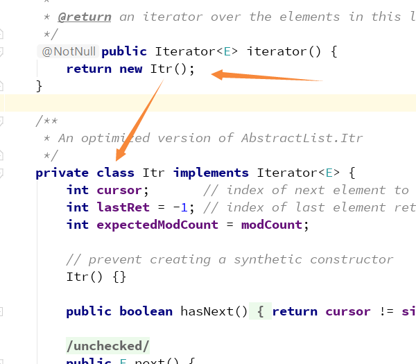

## 工厂方法模式
### 引入
```
我们知道, 对于简单工厂来说, 弊端就是不利于扩展, 违反了开闭原则, 而工厂方法模式就是对简单工厂的一个改进
```

### 以一段代码来看看工厂方法模式
- Fruit
  ```java
  public interface Fruit {
    void produce ();
  }
  ```
- Apple 
  ```java
  public class Apple implements Fruit {
    @Override
    public void produce () {
      System.out.println( "生产苹果..." );
    }
  }
  ```
- Orange
  ```java
  public class Orange implements Fruit {
    @Override
    public void produce () {
      System.out.println( "生产橙子..." );
    }
  }
  ```
- 工厂对象的接口(FruitFactory)
  ```java
  public interface FruitFactory {
    Fruit getFruit ();
  }
  ```
- 苹果工厂对象
  ```java
  public class AppleFactory implements FruitFactory {
    @Override
    public Fruit getFruit () {
      return new Apple();
    }
  }
  ```
- 橙子工厂对象    
  ```java
  public class OrangeFactory implements FruitFactory {
    @Override
    public Fruit getFruit () {
      return new Orange();
    }
  }
  ```
- 测试类
  ```java
  public class TestClass {
    public static void main (String[] args) {
        Fruit apple = new AppleFactory().getFruit();
        apple.produce();

        Fruit orange = new AppleFactory().getFruit();
        orange.produce();
    }
  }
  ```

### 分析
```
通过代码可以看出, 我们将生产对象的工厂方法进行了抽象化,使得工厂对象的创建处于工厂接口的子类中, 即
AppleFactory为真正的工厂对象, 而其是FruitFactory的子类, 如果之后增加一种水果对象, 那么可以通过创
建一个该水果对象的类, 并继承于FruitFactory即可, 这样就解决了简单工厂的不符合开闭原则的弊端
```

### 以Collection抽象类中运用的工厂方法来举例
```
根据源码可以看到, 整个抽象类中只有一个抽象方法iterator是返回对象的(其它的要么是返回基本数据类型, 
要么就是default默认方法),既然是抽象方法, 又返回对象, 那么就跟我们的Fruit类有点类似了,然后我们找到
它的一个实现类ArrayList, 发现iterator方法中确实返回了一个对象new Itr(), 如下图所示:
```

  

  

### 看完以上的代码, 我们再来看看工厂方法的描述
```
定义: 定义一个创建对象的接口
但让实现这个接口的类来决定实例化哪个类, 工厂
方法让类的实例化推迟到子类中进行

使用场景: 
  <1> 创建对象需要大量重复的代码
  <2> 客户端不依赖于产品类实例如何被创建、实现等细节
  <3> 一个类通过其子类来指定创建哪个对象 

优点: 
  <1> 用户只需要关系所需产品对应的工厂, 无需关心创建细节
  <2> 加入新产品符合开闭原则, 提高可扩展性 

缺点:
  <1> 类的个数容易过多, 增加复杂度
  <2> 增加了系统的抽象性和理解难度    
```