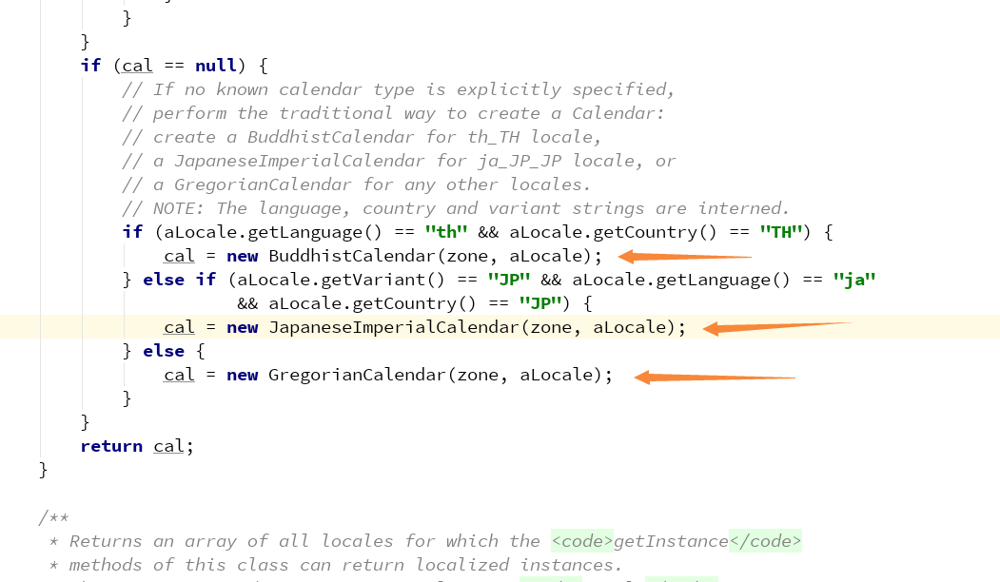

## 简单工厂
### 描述
  ```
  简单工厂不属于23种设计模式中的一种, 利用简单工厂
  模式来更加清楚的理解工厂方法模式和抽象工厂模式
  ```
### 先看一段代码(需要生产水果)
- 水果的接口  
  ```
  public interface Fruit {
    void produce();
  }
  ```
- 苹果
  ```
  public class Apple implements Fruit {
    public void produce () {
      System.out.println( "生产苹果...." );
    };
  }
  ```  
- 橙子
  ```
  public class Orange implements Fruit {
    public void produce () {
      System.out.println( "生产橙子...." );
    };
  }
  ```  
- 简单工厂的实现
  ```
  public class FruitFactory {
    public static Fruit getFruit (String name) {
      if ( "apple".equalsIgnoreCase( name ) ) {
        return new Apple();
      } else if ( "orange".equalsIgnoreCase( name ) ) {
        return new Orange();
      }

      return null;
    }
  }
  ```
### 分析
  ```
  缺点: 根据上面的代码可以看到, 我们水果的生产工厂中通过判断
        name来实现生产哪一种水果, 那么这就会导致一个问题, 如果
        后期需要增加生产的水果, 就需要去修改工厂对象的源代码, 从
        而违反了开闭原则(对扩展开放, 对修改关闭)
  优点: 可以通过传参的方式来获得需要的对象
  ```
### 通过反射来改造工厂类
  ```
  public class FruitFactory {
    public static Fruit getFruit (Class cl) {
      Fruit fruit = null;

      try {
        fruit = (Fruit)Class.forName( cl.getName() ).newInstance();
      } catch (InstantiationException e) {
        e.printStackTrace();
      } catch (IllegalAccessException e) {
        e.printStackTrace();
      } catch (ClassNotFoundException e) {
        e.printStackTrace();
      }

      return fruit;
    }
  }
  ```
### 以Calendar日历类中的createCalendar方法来说
  
  

  ```
  可以看到, 根据传入的参数不同, 返回不同国家的Calendar对象
  ```

