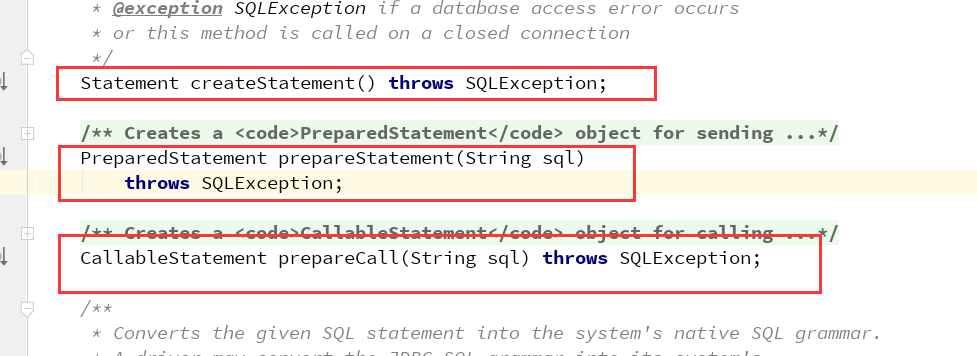
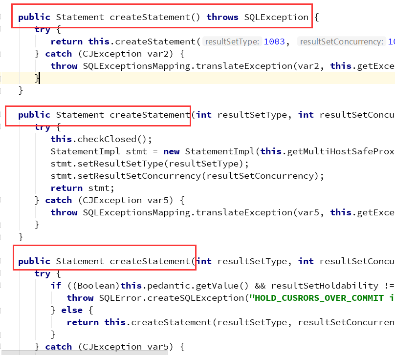

## 抽象工厂模式
### 引入
```
工厂方法模式的一种改进版本就是抽象工厂模式, 我们
知道在工厂方法模式中, 利用对应的水果工厂来生产水果
对象, 并且呢这个水果工厂只能够生产一个水果, 现在
有这样的需求, 一个水果和该水果的描述放为一组,在
说实现这个抽象工厂之前我们先来聊一聊什么是产品等级
和产品族

产品等级: 指的是所有的产品都是同一层次的, 比如苹果,
          橙子, 橘子等都是指水果, 它们是同一等级的
产品族: 产品族指的是一种产品的所有相关的信息, 如苹果
        加上苹果的描述就是一组水果, 也可称为产品族

再举一个例子, 小米手机, 小米冰箱, 小米路由器即为一个产品族,
华为手机, 华为冰箱, 华为路由器也是一个产品族, 而小米手机,
华为手机即为一个产品等级, 小米冰箱和华为冰箱也是一个产品等级
```
### 来看一段代码是如何使用抽象工厂方法的
  ```
  以小米手机, 小米冰箱, 华为手机, 华为冰箱为例
  ```
- 手机类
  ```
  public abstract class Phone {
    public abstract void produce ();
  }
  ```
- 小米手机
  ```
  public class MiPhone extends Phone {
    @Override
    public void produce () {
      System.out.println( "生产小米手机..." );
    }
  }
  ```
- 华为手机
  ```
  public class HuaWeiPhone extends Phone {
    @Override
    public void produce () {
      System.out.println( "生产华为手机..." );
    }
  }
  ```
- 冰箱类
  ```
  public abstract class Box {
    public abstract void produce ();
  }
  ```
- 小米冰箱
  ```
  public class MiBox extends Box {
    @Override 
    public void produce () {
      System.out.println( "生产小米冰箱..." );
    }
  }
  ```
- 华为冰箱
  ```
  public class HuaWeiBox extends Box {
    @Override
    public void produce () {
      System.out.println( "生产华为冰箱..." );
    }
  }
  ```
- 工厂抽象对象
  ```
  public abstract class Factory {
    public abstract Phone getPhone ();
    public abstract Box getBox ();
  }
  ``` 
- 小米工厂对象
  ```
  public class MiFactory extends Factory {
    @Override
    public Phone getPhone () {
      return new MiPhone();
    }

    @Override
    public Box getBox () {
      return new MiBox();
    }
  }
  ```
- 华为工厂对象
  ```
  public class HuaWeiFactory extends Factory {
    @Override
    public Phone getPhone () {
      return new HuaWeiPhone();
    }

    @Override
    public Box getBox () {
      return new HuaWeiBox();
    }
  }
  ```
- 测试类
  ```
  public class TestClass {
    public static void main (String[] args) {
      MiFactory miFactory = new MiFactory();
      Phone miPhone = miFactory.getPhone();
      Box miBox = miFactory.getBox();
      miPhone.produce();
      miBox.produce();

      HuaWeiFactory huaWeiFactory= new HuaWeiFactory();
      Phone huaWeiPhone = huaWeiFactory.getPhone();
      Box huaWeiBox = huaWeiFactory.getBox();
      huaWeiPhone.produce();
      huaWeiBox.produce();

    }
  }
  ```
### 分析
```
由以上的代码可以看出, 一个工厂对象生产的是一类产品, 也叫生产
一个产品族, 这个和工厂方法模式就是不一样了, 工厂方法生产的是
一个产品, 并且抽象工厂模式针对的是一类产品的生产, 比如小米工厂
生产的就一定是小米的产品, 而工厂方法模式针对的是一个产品等级
```

### 以Connection连接对象来看看抽象工厂方法的应用
```
由下图可以看到, 连接对象中定义了多个抽象方法, 这些抽象方法的
返回值都是对象, 以Connection接口的一个实现类ConnectionImpl
来举例可以看到, 里面实现了这些抽象方法
```






### ### 看完以上的代码, 我们再来看看抽象工厂方法的描述
  ```
  定义: 抽象工厂模式提供一个创建一些列相关或相互
        依赖对象的接口
  无需指定它们具体的类

  适用场景:
    <1> 客户端应用层不依赖于产品类实例如何被创建、
        实现等细节
    <2> 强调一系列相关的产品对象(属于同一产品族)一起使用
        创建对象需要大量重复的代码
    <3> 提供一个产品类的库, 所有的产品以同样的接口实现, 从
        而使客户端不依赖于具体实现    

   总结: 对于抽象工厂方法来说, 由于其实现了抽象工厂类后的
        工厂类是需要定好有哪些产品的, 也就是说, 如果未来
        需要添加新的产品, 那么就违反了开闭原则了, 但是站在
        另一个角度上来说, 我们可以添加更多的工厂类, 即更多
        的产品族, 这方面却是遵守了开闭原则     
  ```

