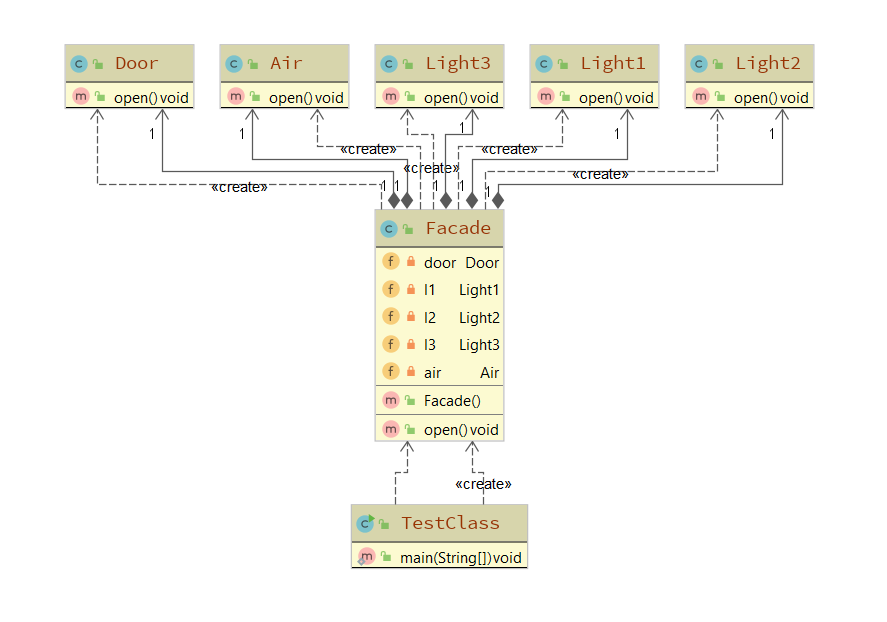

## 外观模式

### 场景引入
```
假设张三回到家之后, 需要打开门, 然后依次打开第一盏灯, 第二盏灯,第三盏灯, 然后再开启空调, 那么如果
一个个去做这些事情, 就会显得很繁琐, 那么我们可以把这些工作都集成为一个开关, 从而一键开启所有的功能,
而这些灯和空调, 门就是外观模式的子系统, 这个开关就是一个外观者, 而张三就是客户端, 外观模式要求所有
的子系统由外观者来管理, 而客户端只需要管理外观者即可
```

### 子系统
```
门类:
  public class Door {
    public void open () {
      System.out.println( "开门" );
    }
  }

第一盏灯类:
  public class Light1 {
    public void open () {
      System.out.println( "开启第一盏灯" );
    }
  } 

第二盏灯类:
public class Light2 {
  public void open () {
    System.out.println( "开启第二盏灯" );
  }
} 

第三盏灯类:
public class Light3 {
  public void open () {
    System.out.println( "开启第三盏灯" );
  }
} 

空调类:
  public class Air {
    public void open () {
      System.out.println( "开启空调" );
    }
  }
```

### 非外观模式下的测试类
```
public static void main (String[] args) {
  Door door = new Door();
  Light1 l1 = new Light1();
  Light2 l2 = new Light2();
  Light3 l3 = new Light3();
  Air air = new Air();

  door.open();
  l1.open();
  l2.open();
  l3.open();
  air.open();
}

我们可以看到, 如果这个功能需要被多个人调用的话, 那么代码就会进行重复, 所以可以将这些子系统集成起来,
形成外观者模式, 用户直接访问外观者, 而真正去操控子系统的人是外观者
```

### 优化(增加外观者角色)
```
public class Facade {
  private Door door;
  private Light1 l1;
  private Light2 l2;
  private Light3 l3;
  private Air air;

  public Facade () {
    door = new Door();
    l1 = new Light1();
    l2 = new Light2();
    l3 = new Light3();
    air = new Air();
  }

  public void open () {
    door.open();
    l1.open();
    l2.open();
    l3.open();
    air.open();
  }
}
```
### 测试类
```
public class TestClass {
  public static void main (String[] args) {
    Facade facade = new Facade();
    facade.open();
  }
}
```

### 分析
```
通过外观者模式, 我们将子系统的调用集成到了一个外观者角色上,这样客户端就只需要调用外观者就可以实现
使用所有的子系统了
```

### UML



### 优化一: 单例外观者模式
```
我们这个外观者其实只要一个对象就够了, 各个客户端都可以通过调用这个对象来实现调用子系统

public class SingletonFacade {
	public final static SingletonFacade instance;

	static {
		instance = new SingletonFacade();
	}
	
	public SingletonFacade getInstance () {
		return instance;
	}

	private Door door;
	private Light1 l1;
	private Light2 l2;
	private Light3 l3;
	private Air air;

	private SingletonFacade () {
		door = new Door();
		l1 = new Light1();
		l2 = new Light2();
		l3 = new Light3();
		air = new Air();
	}

	public void open () {
		door.open();
		l1.open();
		l2.open();
		l3.open();
		air.open();
	}
}
```

### 总结
```
定义: 又叫门面模式, 提供了一个统一的接口, 用来访问子系统中的一群接口外观模式定义了一个高层接口, 
      让子系统更容易使用

优点:
    简化了调用过程, 无需了解深入子系统, 防止带来风险
    减少系统依赖、松散耦合
    更好的划分访问层次
    符合迪米特法则, 即最少知道原则, 客户端不用跟子系统交互

缺点:
    增加子系统、扩展子系统行为容易引入风险
    不符合开闭原则
```